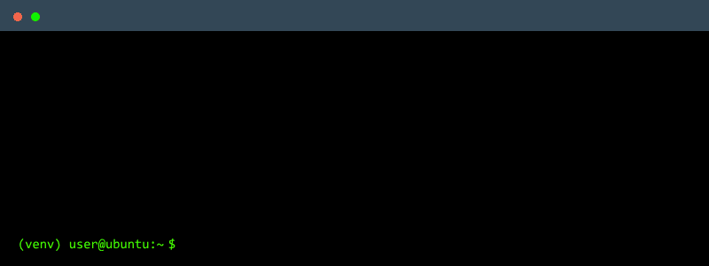
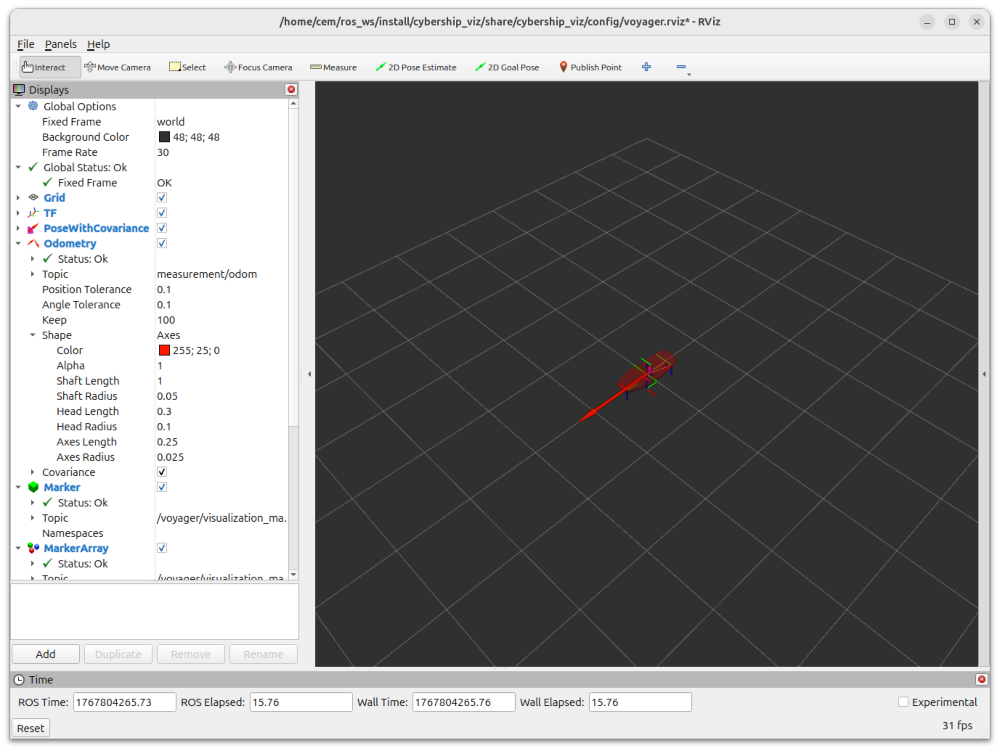

# TMR4243 Lab Exercises

This software suite designed for to be used as a course material. It should not
be taken as a basis for other projects as the software might change for the
vehicle.
<!--
## Crash course!

Do take a look at the [Jupyter Notebooks inside](notebooks) and the code inside of the [`example_dummy`](example_dummy) package. -->

## Installation

> This package is designed for Python 3, [ROS Jazzy](https://docs.ros.org/en/jazzy/index.html), and [Ubuntu 24.04 (Noble)](https://releases.ubuntu.com/noble/).
Before proceeding with the packages, please follow the [installations for ROS](https://docs.ros.org/en/humble/Installation.html) and
python.

1. Create a workspace

    ```bash
    mkdir -p ~/ros_ws/src
    ```

1. Go to the [Cybership Software Suite Repository](https://github.com/NTNU-MCS/cybership_software_suite) Follow the installation instructions for Cybership Software Suite

1. Navigate to the workspace and clone the repository inside the workspace

    ```bash
    cd ~/ros_ws/src
    git clone https://github.com/NTNU-MCS/TMR4243_LAB.git
    ```

1. Install ROS dependencies

    ```bash
    cd ~/ros_ws
    rosdep install --from-paths src --ignore-src -r -y
    ```

1. After installation, install the required python packages. You should be inside a python virtual environment from the Cybership Software Suite setup.

    ```bash
    find ~/ros_ws/src -name "requirements*txt" -exec pip install -r {} \;
    ```

1. After installing the python packages, you can build

    ```bash
    cd ~/ros_ws
    colcon build --symlink-install
    ```

1. If there is any problem with the instructions, [create a github issue](https://github.com/NTNU-MCS/TMR4243_LAB/issues/new).

## Quick Start



```bash
ros2 launch tmr4243_utilities demo.simulation.launch.py
```

## Web joystick (browser -> `/joy`)

If you run the simulation over WSL or virtual machine where you might have problem with joystick passthrough, you can use the web joystick bridge. It uses a simple websocket server to send joystick inputs from a web page to ROS. To use it:

```bash
ros2 launch tmr4243_utilities web_joystick.launch.py
```

Open the page in a browser on the same machine:
`http://127.0.0.1:8000/joystick.html`

By default it binds only to localhost. To use it from another device on the same network, set `http_host:=0.0.0.0 ws_host:=0.0.0.0`.

See the simulation


## Topics

- **topic**: `/tmr4243/state/eta`

  **type**: `std_msgs/msg/Float32MultiArray`

  **description**: Holds the navigation data for the vehicle. Position and
  orientation

  $\eta = [x, y, \psi]^\top$

- **topic**: `/tmr4243/state/nu`

  **type**: `std_msgs/msg/Float32MultiArray`

  **description**: Body-fixed velocity (from odometry).

  $\nu = [u, v, r]^\top$

- **topic**: `/tmr4243/state/tau`

  **type**: `std_msgs/msg/Float32MultiArray`

  **description**: Body-fixed force computed from the commanded thrusters.

  $\tau = [F_x, F_y, M_z]^\top$

- **topic**: `/tmr4243/command/u`

  **type**: `std_msgs/msg/Float32MultiArray`

  **description**: Control inputs for the actuators. Published by the teleop node
  or your custom control node and converted by the utility node into individual
  thruster wrench commands.

  $u = [u_0, u_1, u_2, \alpha_1, \alpha_2]^\top$

  - $u_0 \in [-1, 1]$, Controls the force of the tunnel thruster
  - $u_1 \in [0, 1]$, Controls the force of the port thruster
  - $u_2 \in [0, 1]$, Controls the force of the starboard thruster
  - $\alpha_1 \in [-\pi, \pi]$, Controls the force direction for port thruster
  - $\alpha_2 \in [-\pi, \pi]$, Controls the force direction for starboard thruster

- **topic**: `/joy`

  **type**: `sensor_msgs/msg/Joy`

  **description**: Joystick inputs. When using the web joystick bridge, `Joy.buttons` contains pressed state (0/1) and analog button values (e.g., triggers) are appended to the end of `Joy.axes`.

## Custom Messages

- `tmr4243_interfaces/msg/observer.msg`

  ```text
    float64[] eta
    float64[] nu
    float64[] bias
    ```

- `tmr4243_interfaces/msg/reference.msg`

  ```text
    float64[] eta_d
    float64[] eta_ds
    float64[] eta_ds2
    float64 w
    float64 v_s
    float64 v_ss
    ```

- `tmr4243_interfaces/msg/s.msg`

  ```text
    float64 s
    float64 s_dot
    ```

## Glossary of variables

- $\eta \rightarrow$ State variable
- $u \rightarrow$ Control command
- $\tau \rightarrow$ Body fixed force
